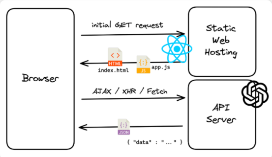
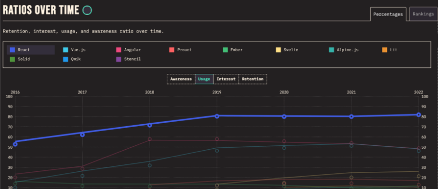
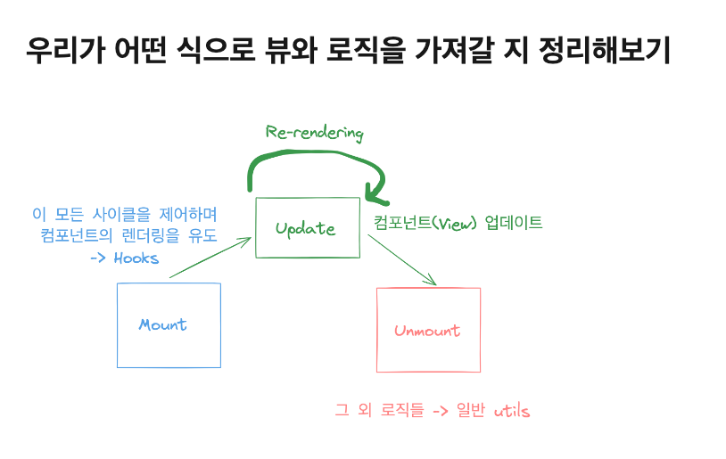
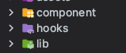
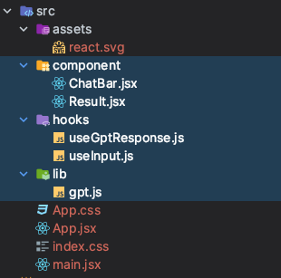

# 나만의 GPT 만들기

20231129 GDSC EWHA 세션 by. 박나희 에 참여하고 정리함요

## 웹 FE 개발을 한다는 것

- 전통적인 방식에서는 php, jsp와 같이 클라이언트 사이드와 서버사이드 구분이 없었음.
- 최근 CSR 방식의 프레임워크..가 .. 유행인가(ssr 도 다시 부상하긴 했지만.)

Multiple Page Application → 서버 사이드에서 새로운 페이지로 갈 때마다 필요한 리소스를 전송, 매번 서버에서 리로드를 하는 것은 과부하로 인한 속도저하가 있음

Single Page Application → 클라이언트 사이드에서 부분적으로 로드, MPA의 속도저하를 해결하기 위한 방법. 첫 페이지에서 필요한 리소스 파일을 모두 로드하고, 페이지가 이동함에 따라 리소스를 실행하며 보여줌.

### 오늘 실습: React

React를 이용해서 클라이언트 사이드를 구축.
추가적으로 필요한 리소스를 ChatGPT API로 가져온다.

브라우저의 관점
1. GET 요청을 보낸다
2. 호스팅된 정적 리소스를 전송받는다. (`index.html`, `app.js`)

3. 필요한 경우 AJAX/XHR/Fetch 등 요청을 보낸다.
4. API 서버로부터 응답을 받는다.

### +) 리액트 쓰는 이유

- 리액트는 User Interface 구축을위한 Javascript UI library.
- 컴포넌트 기반 개발.
- **기본적으로** Single Page Application 지원
  - webpack의 설정을 통해 SSR 부분지원 가능
  - Next.js 프레임워크를 통해 SSR 구현 가능
- 효율적인 리렌더링 방식: 변화한 부분만 감지해서 렌더링
- **가장 많이 쓰인다**

## 우리가 오늘 뷰를 그리는 법

- api를 호출하는 행위를 브라우저는 모른다. 브라우저가 리랜더링되기 위해서는 그걸 알리는 역할이 필요한데, 리액트에서는 그 역할을 Hook이 담당한다.

이걸 참고해서 파일 구조를 보면 구조 이해가 쉽다.

- hooks가 컴포넌트를 리랜더링 시키는 역할을 한다.

- `/component` : react component를 두는 디렉터리
- `/hooks`: 커스텀 Hook을 두는 디렉터리
  - 커스텀 훅 → 리액트 훅을 사용하기 편하게 wrapping 한 것을 지칭
  - 리액트 컴포넌트를 리랜더링시키기 위해서는 반드시 리액트 훅을 사용해야하기 때문에.

- `/lib`: 그 외 라이브러리 사용 모듈을 여기에 둔것 (으로 예상)

펼쳐보면

우리의 컴포넌트는 채팅바와 결과 요 두가지가 있고, 훅은 input을 사용하는 것과 gptReponse를 활용하는 것 두개 그리고 gpt 라이브러리 호출로직은 gpt.js가 있당.

# React + Vite

This template provides a minimal setup to get React working in Vite with HMR and some ESLint rules.

Currently, two official plugins are available:

- [@vitejs/plugin-react](https://github.com/vitejs/vite-plugin-react/blob/main/packages/plugin-react/README.md) uses [Babel](https://babeljs.io/) for Fast Refresh
- [@vitejs/plugin-react-swc](https://github.com/vitejs/vite-plugin-react-swc) uses [SWC](https://swc.rs/) for Fast Refresh
